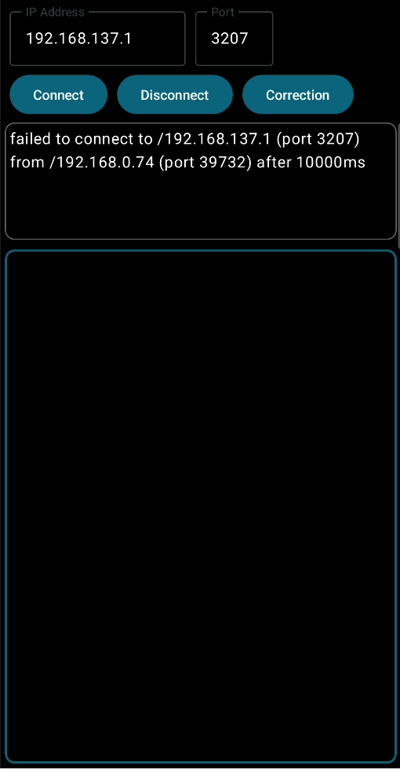

# Phone-based Controller with Eye-tracking For Mobile VR
모바일 VR 환경을 위한 시선 추적 기반 스마트폰 컨트롤러

## 개요
- VR 기기의 발전으로 모바일 환경에서도 독립적인 VR 경험 가능
- 기존 VR 인터페이스와 컨트롤러는 넓은 공간을 요구
- 공공장소나 제한된 공간에서 VR 즐기기 어려움
- 시선 추적을 활용해 VR 객체 선택, 스마트폰 화면으로 조작 제안
- 공간 제한 해결

## 앱 설계

- HMD의 시선 추적을 통해 VR 객체 선택
- 스마트폰 터치스크린으로 객체 조작
- 스마트폰의 자이로스코프와 지자기 센서로 객체 이동 평면 설정

## 소스코드 구성

1. **안드로이드 앱** [ /Controller/* ]: 스마트폰 센서 데이터 수집 후 VR 환경에 전달
2. **Unity 프로젝트** [ /My Project/* ]: VR환경에서 시선 추적 및 객체 조작 구현

## 안드로이드 앱 
Jetpack Compose로 제작된 안드로이드 어플리케이션은 다음과 같이 구성되어 있음
- **센서 데이터 수집**: 회전 벡터 센서로 스마트폰의 회전 정보를 수집
- **TCP 통신**: 스마트폰의 회전 벡터 및 화면 제스처를 VR 환경에 전달
- **UI 구성**: IP 주소와 포트 설정, 제스처 감지 영역 제공


### 주요 코드
- **센서 관리**: `onResume()`과 `onPause()`에서 `sensorManager`를 사용한 회전 벡터 리스너 등록 및 해제
	```kotlin
	override fun onResume() {
		...
		// MainActivity.kt 97:99
		sensorManager.apply {
		registerListener(this@MainActivity, rotationVector,
		SensorManager.SENSOR_DELAY_GAME)
		}
	}
	override fun onPause() {
		...
		// MainActivity.kt 105
		sensorManager.unregisterListener(this)
	}
	```
- **데이터 전송**: 쿼터니언 형태로 회전 데이터를 TCP로 전송
- **터치 및 제스처 감지**: Jetpack Compose의 `.pointerInput`으로 탭 및 드래그 제스처 감지, VR 환경에 전달

## VR 환경 
HTC VIVE Pro와 Tobii XR SDK를 사용해 Unity 2019.4.40f1에서 구현
- **시선 추적**: Tobii XR SDK를 통해 아이 트래킹 정보를 받아옴
- **객체 조작**: `SelectAtGaze.cs`로 실시간 시선에 따라 객체 선택
- **TCP 통신**: `TCPSocket.cs`로 안드로이드 앱과 TCP 통신 관리

## 사용 모습


## 기대효과

- **공간 효율성**: 시선 추적을 통한 오브젝트 선택으로 좁은 공간에서도 효과적인 VR 환경 조작 가능
- **직관적 조작**: 스마트폰 화면을 통한 자연스러운 객체 조작
- **자원 효율성**: 외부 트래킹 장비가 필요 없어 비용 및 소비전력 절감
- **다양한 제스처 가능성**: 오브젝트 조작을 위해 드래그 외 핀치, 탭 등 여러 제스처 활용 가능
